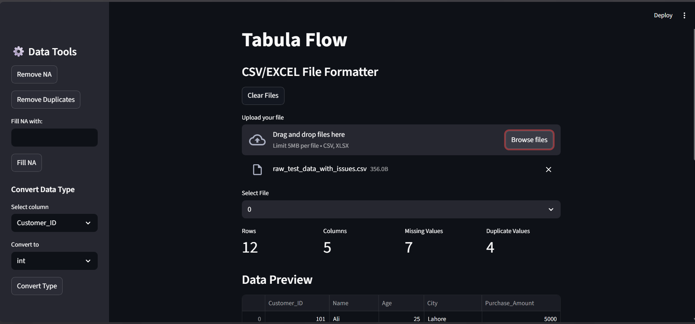
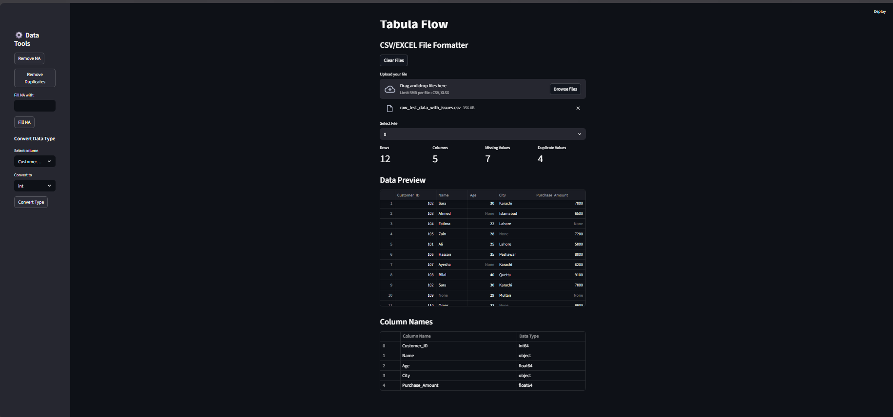

# Tabula-Flow-CSV-EXCEL-Cleaning-Dashboard.-
Tabula flow is a quick and easy data cleaning dashboard that is built using Python, Streamlit &amp; Pandas. It offers quick and easy basic data cleaning functions. The Goal of this project is to allow users to complete complex and time consuming data tasks in a matter of a few seconds. It's inspired by "ILOVEPDF" philosophy. 

## Requirments 

Python 
Pandas 
Streamlit 

## Clone Repo 

Clone the repository:
   ```bash
   git clone https://github.com/neonhydrogennh2-dotcom/Tabula-Flow-CSV-EXCEL-Cleaning-Dashboard.git
  ```
  ```bash
   cd repository-name
   ```

## Screenshots



